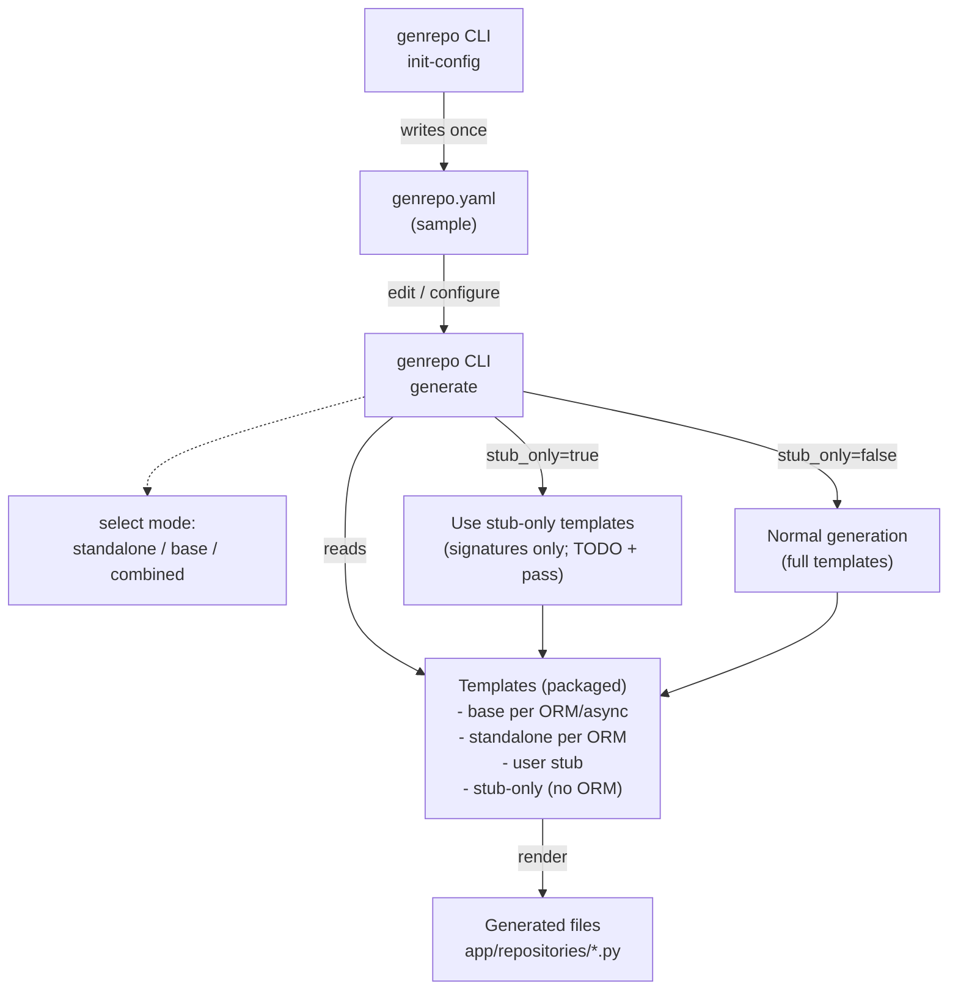

# Genrepo

Generate typed, readable data-access repositories for FastAPI apps using SQLModel or SQLAlchemy. Genrepo removes CRUD boilerplate by rendering Jinja2 templates into real Python code that follows the Repository Pattern. It supports three generation modes (standalone, base-only, combined) and an optional stub-only mode (no ORM, structure only).

Explore concrete configurations in the `examples/` folder to see common scenarios and how to tailor `genrepo.yaml`.

---

## What it is / isn’t

- Is: a small CLI that
  - Reads a `genrepo.yaml` configuration.
  - Renders Jinja2 templates to per-model repository files.
  - Standardizes naming, docstrings, and common CRUD methods.
- Isn’t:
  - An ORM.
  - An API router/service generator.
  - A migration or database session/engine manager.

## Requirements

- Python 3.10+ (tested on 3.10–3.13).
- Dependencies managed via `uv` (recommended) or classic `pip`.

## Installation

Install from PyPI (recommended):

```bash
pip install genrepo
```

Install via pipx (isolated):

```bash
pipx install genrepo
```

Install from local artifacts (dist/):

```bash
pip install dist/genrepo-0.1.5-py3-none-any.whl
# or
pip install dist/genrepo-0.1.5.tar.gz
```

## Quickstart (installed)

```bash
# Verify installation
genrepo healthcheck --verbose

# 1) Create a starter genrepo.yaml (combined + example)
genrepo init-config

# 2) Open and configure genrepo.yaml (models, methods, etc.)
#    Then generate repositories from the YAML
genrepo generate
```

## Quickstart (uv)

```bash
# Install deps from uv.lock (creates .venv)
uv sync

# Verify environment
uv run genrepo healthcheck --verbose

# 1) Create a starter genrepo.yaml (combined + example)
uv run genrepo init-config

# 2) Open and configure genrepo.yaml (models, methods, etc.)
#    Then generate repositories from the YAML
uv run genrepo generate
```

Or activate the venv manually:

```bash
source .venv/bin/activate
genrepo healthcheck --verbose
```

Upgrading from older Python: after bumping to 3.12.9, regenerate the lockfile and environment:

```bash
uv sync --python 3.12.9
```

## CLI Commands

### healthcheck

Checks CLI readiness. With `--verbose` prints versions.

Installed:

```bash
genrepo healthcheck
genrepo healthcheck --verbose
```

From repo (dev):

```bash
uv run genrepo healthcheck
uv run genrepo healthcheck --verbose
```

### init-config

Creates a `genrepo.yaml` sample (combined mode by default). If the file already exists, it does not overwrite it unless `--force` is provided.

Options:

- `--path/-p`: target path (default `genrepo.yaml`).
- `--force/-f`: overwrite existing file.

Installed:

```bash
genrepo init-config
genrepo init-config --path config/genrepo.yaml
```

From repo (dev):

```bash
uv run genrepo init-config
uv run genrepo init-config --path config/genrepo.yaml
```

### generate

Reads `genrepo.yaml` and generates repositories according to the selected mode.

Options:

- `--config/-c`: path to `genrepo.yaml` (default `genrepo.yaml`).
- `--templates-dir`: override templates directory (e.g., `./templates`).
- `--force/-f`: overwrite existing generated files (only where applicable).
- `--stub-only`: generate stub-only repositories (structure only, no ORM logic).

Installed:

```bash
genrepo generate
genrepo generate --stub-only
```

From repo (dev):

```bash
uv run genrepo generate
uv run genrepo generate --stub-only
```

## Configuration (`genrepo.yaml`)

Top-level fields:

- `orm`: `sqlmodel` or `sqlalchemy` (ignored if `generation.stub_only: true`).
- `async_mode`: `true|false` to enable AsyncSession and async/await (per ORM).
- `output_dir`: destination folder for generated repositories.
- `generation`:
  - `mode`: `standalone | base | combined`.
  - `base_filename`: base filename (default `base_repository.py`).
  - `base_class_name`: base class name (default `BaseRepository`).
  - `overwrite_base`: overwrite base on regeneration (default `false`).
  - `stub_only`: generate skeletons only (structure; no ORM logic).
- Discovery: `models: all` with `models_package` and `models_dir` to discover all models under a package/directory.
- Explicit list: `models: []` to define per-model config.
- `commit_strategy`: `commit|flush|none` (default: `none`). Typically your app/service controls transactions.
- `allow_missing_models`: if `true`, do not fail when an explicit `import_path` cannot be imported.

Per-model (`models[]`):

- `name`, `import_path` (`module.path:Class`), `id_field`, `id_type`.
- `methods`: only base CRUD presets are allowed: `get`, `get_or_raise`, `list`, `find_one`, `create`, `update`, `delete`, `delete_by_id`, `exists`, `count`, plus presets `all` and `none`.
- `personalize_methods`: custom repo-only stubs (combined: user repo, standalone: appended at bottom).

Default sample created by `generate` (combined + wildcard):

```yaml
orm: sqlmodel
async_mode: false
commit_strategy: none

output_dir: app/repositories

generation:
  mode: combined
  base_filename: base_repository.py
  base_class_name: BaseRepository

models:
  - name: All
    import_path: app.models
    id_field: id
    id_type: int
    methods: [none]
    personalize_methods: [calculate_something]
```

Alternative discovery:

```yaml
models: all
models_package: app.models
models_dir: app/models
```

Explicit per-model customization (some base methods + one personalized):

```yaml
orm: sqlmodel
output_dir: app/repositories
generation:
  mode: standalone

models:
  - name: User
    import_path: app.models.user:User  # module:Class
    id_field: id
    id_type: int
    methods: [get, list]              # pick from the base set
    personalize_methods: [calculate_age]
```

## Methods you can generate (base set)

Reading:

- `get(session, id) -> Optional[Model]`: Fetch by primary key, or `None`.
- `get_or_raise(session, id) -> Model`: Same as `get` but raises `NotFoundError` when missing.
- `list(session, *where, limit=100, offset=0) -> list[Model]`: Paginated list with optional SQLAlchemy filter clauses.
- `find_one(session, *where) -> Optional[Model]`: First row matching filters, or `None`.

Writing:

- `create(session, obj) -> Model`: Persist and refresh.
- `update(session, db_obj, obj_in: dict[str, Any]) -> Model`: Apply changes and refresh.
- `delete(session, db_obj) -> None`: Delete by instance.
- `delete_by_id(session, id) -> bool`: Delete by PK; returns `True` if removed.

Utilities:

- `exists(session, *where) -> bool`: Any row matches filters.
- `count(session, *where) -> int`: Count rows matching filters.

Notes:

- In standalone, `methods` limits which of the above are generated in each repository.
- In combined, the base repository exposes the full set; `personalize_methods` adds repo-only stubs in the user repo.
- In stub-only, only method signatures are generated (TODO + pass), without ORM imports or logic.

## Templates

Packaged defaults cover the following scenarios:

- Base repositories per ORM and sync/async.
- Standalone repositories per ORM (async controlled by context).
- Combined user repository stub.
- Stub-only base and standalone (no ORM).

Local overrides (optional): use `--templates-dir ./templates` in `generate` to point to your own copies.

## Template Map

- Base + SQLModel + sync: `base_repository_sqlmodel_sync.j2`
- Base + SQLModel + async: `base_repository_sqlmodel_async.j2`
- Base + SQLAlchemy + sync: `base_repository_sqlalchemy_sync.j2`
- Base + SQLAlchemy + async: `base_repository_sqlalchemy_async.j2`
- Standalone + SQLModel: `repository_sqlmodel.j2`
- Standalone + SQLAlchemy: `repository_sqlalchemy.j2`
- Combined (user repo): `model_repository_user_stub.j2`
- Stub-only (base): `repository_base_stub.j2`
- Stub-only (standalone): `repository_standalone_stub.j2`

## Output

- Location: `output_dir` (default `app/repositories`).
- File name: `<model>_repository.py` (snake_case).
- Class name: `<Model>NameRepository` (PascalCase).

Example (User, standalone):

```python
from sqlmodel import Session, select
from app.models.user import User

class UserRepository:
    def get(self, session: Session, id: int) -> User | None: ...
    def list(self, session: Session, *where, limit: int = 100, offset: int = 0) -> list[User]: ...
    def create(self, session: Session, obj_in: User) -> User: ...
    def update(self, session: Session, db_obj: User, obj_in: dict[str, Any]) -> User: ...
    def delete_by_id(self, session: Session, id: int) -> bool: ...
```

> The imported model (e.g., `app.models.user:User`) must exist in your target project; Genrepo does not create models or configure sessions/engines. Use `allow_missing_models: true` if you want to generate repos even when imports are not yet resolvable.

In combined mode:

- `base_repository.py` → `class BaseRepository[T]` (editable).
- `<model>_repository.py` (user) → `class <Model>Repository(BaseRepository[<Model>])` (created once; extend for your domain).

Stub-only mode generates the same file layout, but with TODO + pass bodies (no ORM logic).

## Flow diagram



Legend: “sa” = standalone.

## Packaging the templates (.j2)

When distributing the library, ensure `.j2` files are included in the wheel/sdist.

Hatchling example:

```toml
[tool.hatch.build.targets.wheel]
packages = ["src/genrepo"]

[tool.hatch.build.targets.wheel.force-include]
"src/genrepo/templates" = "genrepo/templates"
```

Setuptools example:

```
recursive-include src/genrepo/templates *.j2
recursive-include src/genrepo/assets *.yaml
```

## Repository structure (maintainers)

- `src/genrepo/cli/app.py`: Typer CLI. Commands: `init-config` (writes sample YAML), `generate` (generates code), `healthcheck`.
- `src/genrepo/config.py`: Pydantic schema and loader/validation for `genrepo.yaml` (modes, discovery, methods/personalize_methods, errors).
- `src/genrepo/generator.py`: Orchestrates Jinja2 rendering, selects templates by mode/ORM/async or stub-only, writes outputs.
- `src/genrepo/constants.py`: Central constants (messages/errors, CRUD method set, template filenames, sample asset path, ORM IDs).
- `src/genrepo/templates/`: Packaged Jinja2 templates:
  - Base per ORM/async: `base_repository_sqlmodel_sync.j2`, `base_repository_sqlmodel_async.j2`, `base_repository_sqlalchemy_sync.j2`, `base_repository_sqlalchemy_async.j2`.
  - Standalone per ORM: `repository_sqlmodel.j2`, `repository_sqlalchemy.j2`.
  - Combined user repo: `model_repository_user_stub.j2`.
  - Stub-only (no ORM): `repository_base_stub.j2`, `repository_standalone_stub.j2`.
- `src/genrepo/assets/genrepo.sample.yaml`: Default YAML sample used by `generate`.

Notes for contributors
- Keep templates focused (no business logic), one responsibility per file.
- Extend via new templates or constants (e.g., adding ORMs) rather than scattering literals.
- Prefer errors/messages from `constants.py` to keep CLI output consistent and localizable.

And configure `package_data`/`include_package_data` accordingly.

## Docker

- Build locally: `docker build -t genrepo:local .`
- Run the CLI against your project (mount current dir):

```
docker run --rm \
  -v "$PWD":"$PWD" -w "$PWD" \
  genrepo:local generate --check
```

## CI (--check)

Example GitHub Actions job to ensure repositories are up to date:

```
jobs:
  validate-architecture:
    runs-on: ubuntu-latest
    steps:
      - uses: actions/checkout@v4
      - name: Install Genrepo
        run: pip install genrepo
      - name: Verify repositories are up to date
        run: genrepo generate --check

```

### Exit Codes and CI behavior

- `--dry-run`: computes the plan and prints a summary (or JSON when `--format json`), without writing files.
- `--check`: exits with code 1 if any file would be written (drift detected), otherwise 0.
- `--format json`: stdout is strict JSON suitable for parsing; avoid mixing logs into stdout. If you need logs, send them to stderr.

## Tips

- Local template overrides (`--templates-dir`): copy packaged templates, tweak, and point the CLI to your folder.

  ```bash
  # Copy packaged templates locally
  uv run genrepo init-templates --dest ./templates/genrepo

  # Add a tiny marker to verify overrides are being used
  printf "# LOCAL_TPL\n" | cat - templates/genrepo/repository_sqlmodel.j2 > /tmp/t && mv /tmp/t templates/genrepo/repository_sqlmodel.j2

  # Generate using local templates
  uv run genrepo generate --templates-dir ./templates/genrepo
  ```

- Stub-only (skeletons, no ORM):

  ```bash
  uv run genrepo generate --stub-only
  # Repositories contain method signatures + TODO/pass, with no SQLModel/SQLAlchemy imports
  ```

- Discover all models (`models: all`):

  In your `genrepo.yaml`:

  ```yaml
  models: all
  models_dir: app/models
  models_package: app.models
  ```

  All Python files under `models_dir` (excluding dunders) will be mapped as `models_package.<file>:<Class>`.

- Shell completion:

  ```bash
  genrepo --install-completion  # install for your shell
  # zsh: ensure fpath+=($HOME/.zfunc); autoload -U compinit; compinit; source ~/.zshrc
  ```

## Examples

See the `examples/` folder for ready-to-use `genrepo.yaml` samples:

- `examples/standalone_sqlmodel_sync.yaml`: Standalone repos with SQLModel (sync).
- `examples/standalone_sqlalchemy_async.yaml`: Standalone repos with SQLAlchemy (async).
- `examples/combined_sqlmodel.yaml`: Combined mode (base + user repo stubs).
- `examples/combined_sqlmodel_multi.yaml`: Combined with multiple models and per-model methods (SQLModel, sync).
- `examples/combined_sqlmodel_multi_async.yaml`: Combined with multiple models (SQLModel, async).
- `examples/combined_sqlalchemy_multi.yaml`: Combined with multiple models (SQLAlchemy, sync).
- `examples/stub_only.yaml`: Stub-only (signatures + TODO/pass; no ORM).
- `examples/discover_all.yaml`: Discover models automatically from a package.
- `examples/base_only_sqlmodel_sync.yaml`: BaseRepository only (SQLModel, sync).

Copy one to `genrepo.yaml`, adjust `import_path` to your models, and run `genrepo generate`.

## Troubleshooting

- “No module named pydantic/typer”: run inside the venv (`uv run ...`) or `source .venv/bin/activate`.
- `sqlmodel`/`sqlalchemy` missing in your target app: install them in that project.
- “No files generated”: likely exist already; use `--force`.

## License

This project is licensed under the terms of the MIT License.
See the `LICENSE` file for details.
